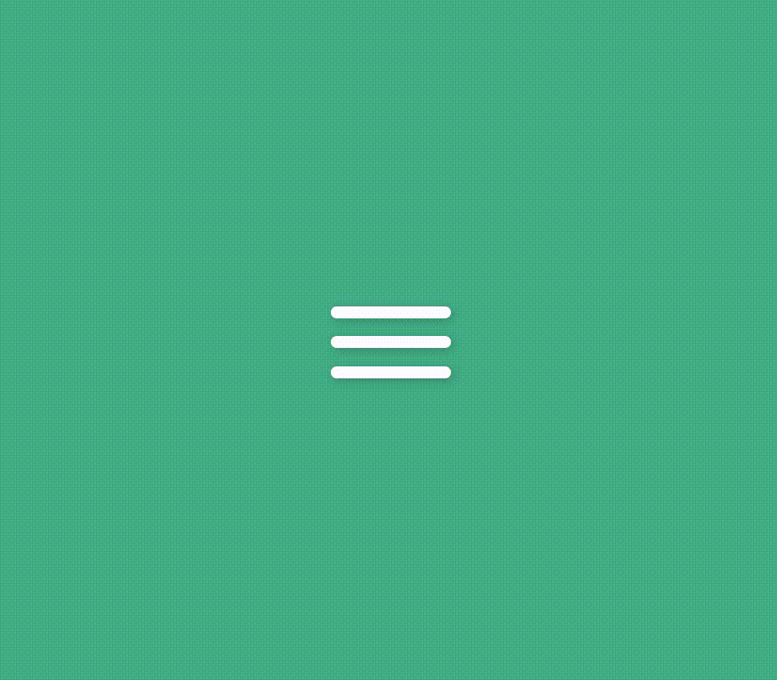

# Desafio de CSS 001: Menu em barras com animação (pure CSS)
Este é um desafio do [100 Days CSS Challenge](https://100dayscss.com/?dayIndex=001)

O desafio 001 é um "Hamburguer button", com animação. A animação só inicializa após o clique na tela.
- Para o posicionamento, utilizei a feature FlexBox
- Para criar as animações utilizei "@keyframe"
- e, para que elas inicializem apenas após o "click", utilizei um input, do tipo "checkbox", que está com "display: none".

  

